# CS 486

## 1. Intro to AI

> ==Lecture 1 (2018-9-10)==

###Administrations 

- see slides

### Definitions of AI

> ==Lecture 2 (2018-9-12)==

- Turing Test - Imitation Game
- **Two approaches towards AI**
  - The Laws of Thought - Logic
    - obstacles: 1. natural language 2. computation complexity (i.e. cannot solve in reasonable time with the knowledge base)
  - The Rational Agent - todo
    - What behaviour is rational? <u>???</u>

- *CQ: Which definition? (p.48) - D*
- **A system is intelligent iff it acts rationally.**
  - Why do we care about behaviour instead of thought processes and reasoning? 1. <u>???</u> 2. rational behaviour is more general
  - Why do we measure sun cess against rationality instead of against humans? 1. human does not represent good rationality 2. rationality can be defined mathematically.

## 2. Search Introduction and Problem Formulation

### Applications of Search

- 华容道 (sliding puzzle)
- Rubik's Cube
- River Crossing Puzzle
- N-Queens Problem (LeetCode)
- Propositional Satisfiability
- Traveling Salesman

### Definition of a Search Problem

- *CQ: Why search? (p.11) - AC*
- 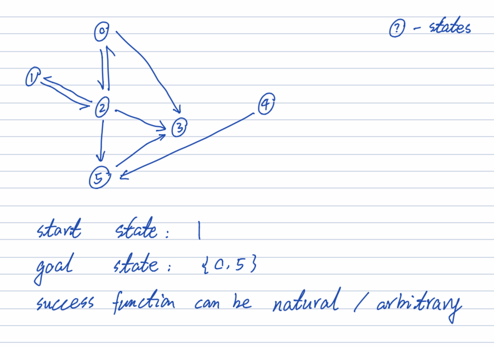
  - successor function might not be natural (arbitrary), e.g. N-Queens Problem, a queen can attack queens from random positions
  - successor function can have impact on complexity, e.g. how many states are there towards the right goal

### Problem Formulation

#### 8-Puzzle

- 

- *CQ: 8-Puzzle (p.16) - A*

- *CQ: Search Graph for 8-Puzzle (p.17) - B*
  - 9! = 362,880; but memory could be out!
  - generally, we rarely represent search graph explicitly (sometimes could be infinite, or very very large)

#### River Crossing Puzzle

- 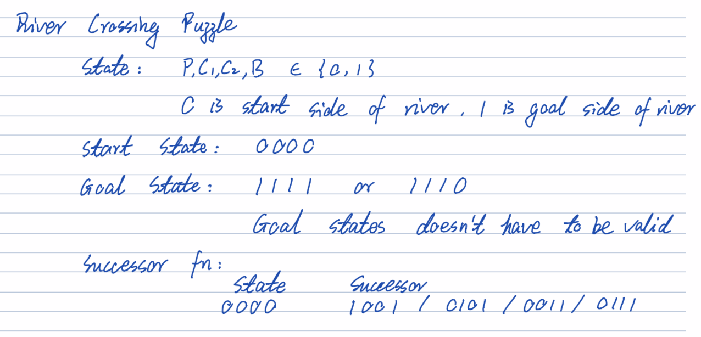

- *CQ: River Crossing Puzzle (p.19) - C*
  - goal state does not have to be valid (logically for the specific question, e.g. boat on the left side)

- *CQ: River Crossing Puzzle (p.20) - B*
  - one child or two children

#### 4-Queens Problem

- 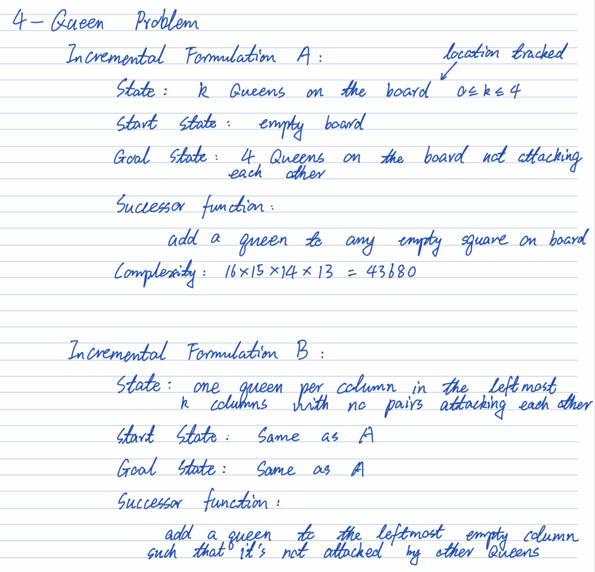

- *CQ: Incremental Formulation A (p.23) - D*
  - $16 \times 15 \times 14 \times 13 = 43680$

- *CQ: Incremental Formulation B (p.24) - A*
  - upper bound: 4!
  - actual: 6

## 3. Uniformed Search

>  ==Lecture 3 (2018-9-17)==

### Uniformed Search

#### Breadth-First Each on River Crossing

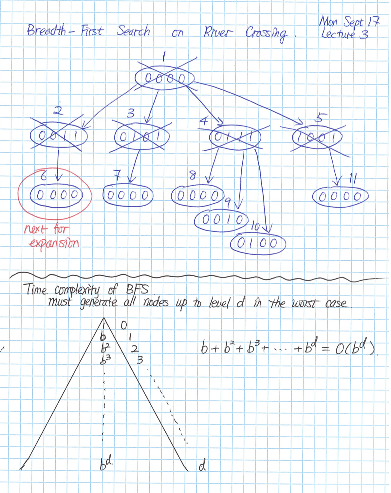

- *CQ: Is BFS complete? (p.13) - C*
- *CQ: Space complexity of BFS (p.14) - B*
- *P.15 - 5 (3?)*

#### Depth-First Each on River Crossing

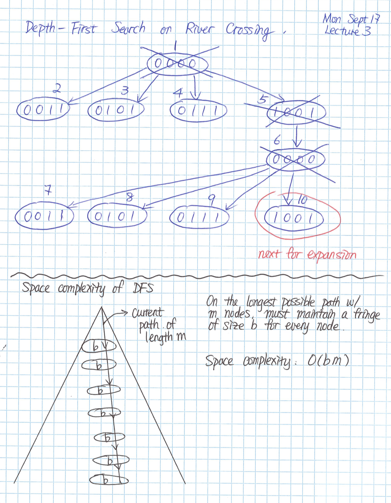

- *CQ: Is DFS complete? (p.18) - D*
- *CQ: Space complexity of DFS (p.19) - C*
  - stack, find the longest
- *P.20 - 1*
- *P.21* - no cycles, gonna be exponential <u>???</u>
- Comparison: BFS more complete, both not very optimal, both bad time complexity, DFS better space complexity
- *CQ: BFS or DFS? (p.23) - A*
  - although some are shallow and some are deep, but BFS can do the shallow ones very fast.
- *CQ: BFS or DFS? (p.24) - D*

#### Iterative-Deepening Search

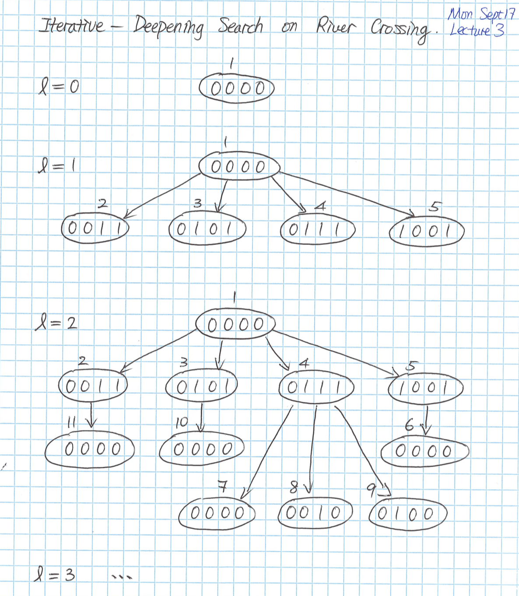

- *P.28 - Is it too costly?* - no, time complexity is bounded
- *CQ: Comparing IDS and DFS? (p.30) - A*
  - IDS is too iterative

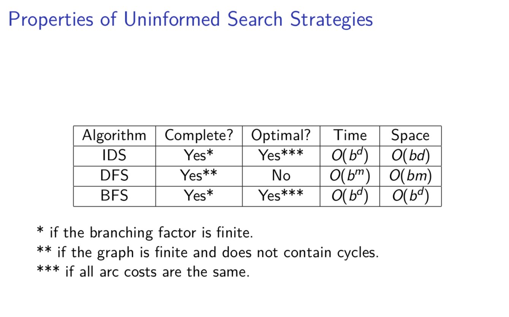

## 4. Informed Search

> ==Lecture 4 (2018-9-19)==

### Using Domain Specific Knowledge

- p.8, p.9 <u>???</u>

- 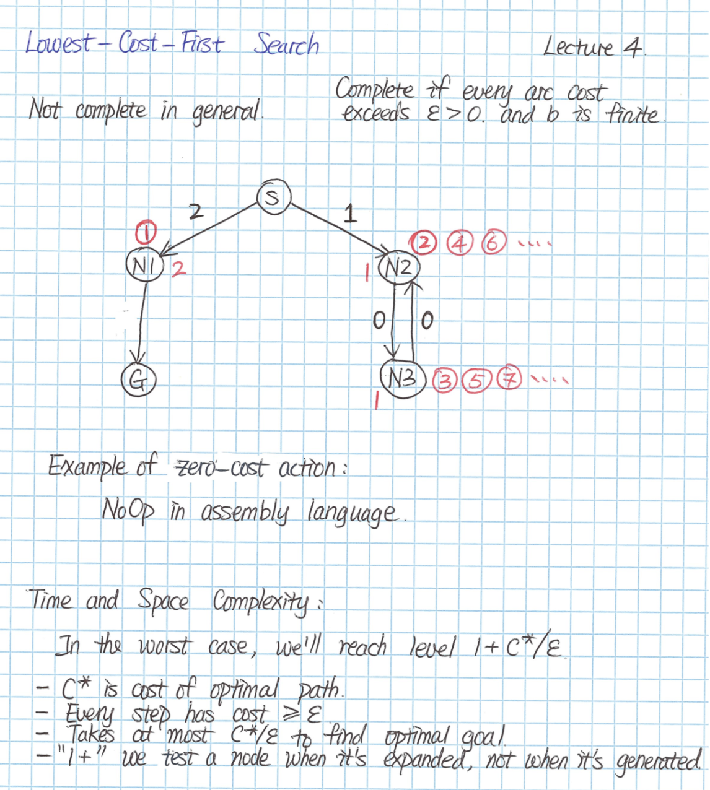

### Lowest-Cost-First Search

- 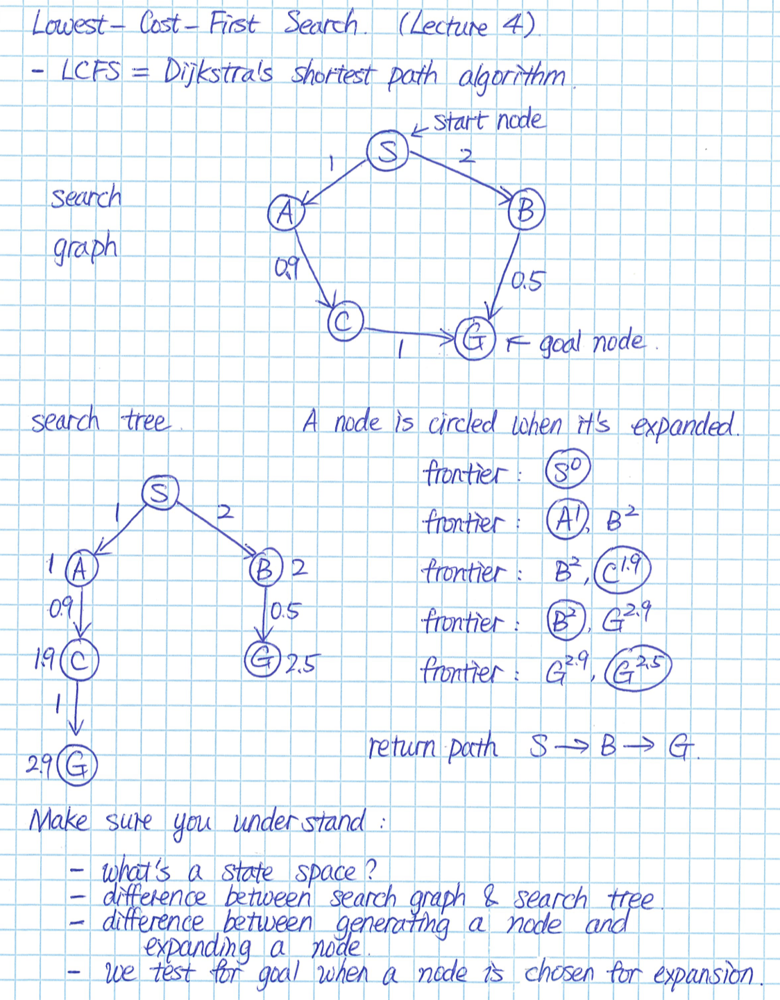

- Complete? Not in general.
- Optimal? Yes, if every arc cost exceeds $\epsilon > 0$ and the branching factor $b$ is finite. 
- Time/Space complexity: "1+" - testing the goal when expand the node.
- *CQ: Is Lowest-Cost-First search Optimal? (p.15) - A*

### Informed  Search Algorithms

#### Greedy Search

- Complete? no
- Optimal? no
- Time/Space complexity: bad, search is unpredictable
- *CQ: Is Greedy Search Complete? (p.18) - A*

- 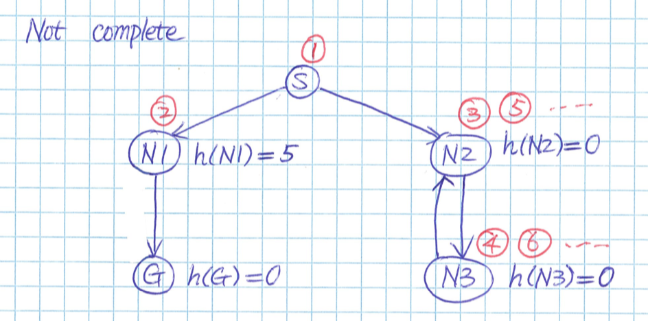
  - search tree & search graph <u>???</u>

- *CQ: Is Greedy Search Optimal? (p.19) - A*
- 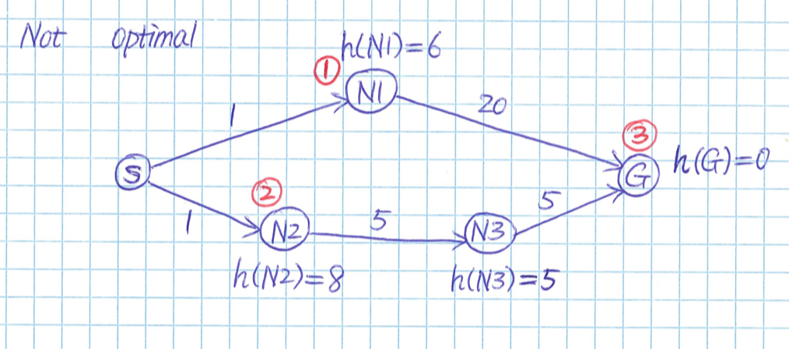

#### A* Search

- Lowest-Cost-First search is a special case of A*, with h(n) = 0
- g(n) - start to current node

- 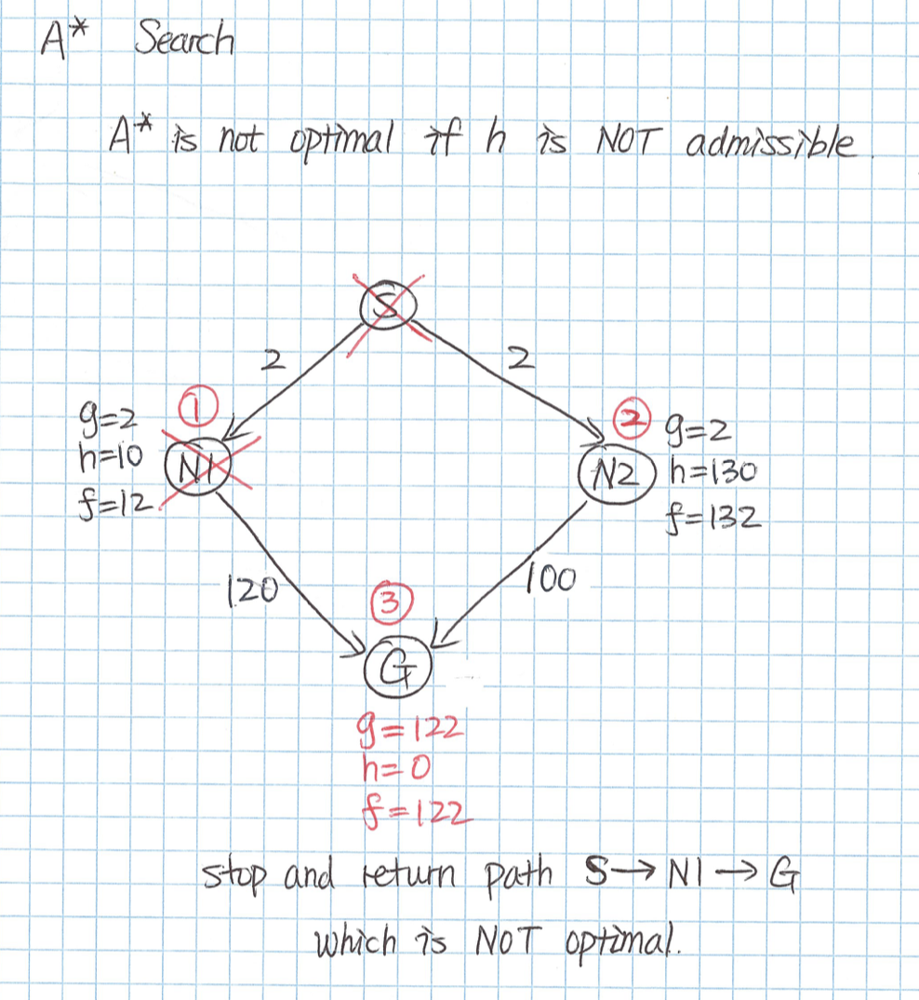
  - greedy - g, lowest first - h, A* - total

#### Iterative Deepening A*

- Increase minimal threshold to ensure finding the solution

### Heuristic Functions

#### Examples of Heuristic Functions

- *CQ: Is this heuristic admissible? (p.28) - B*
  - $h(n) > h^*(n)$, example: 1000 $\rightarrow$ 1111

#### Constructing an Admissible Heuristic

- *CQ: Constructing an Admissible Heuristic (31) - B*
- *CQ: Constructing an Admissible Heuristic (32) - A*

> ==Lecture 5 (2018-9-24)==

- <u>example (additional search graph)</u>
- differences between expanding and generating node
  - expanding node - remove node, adding successor to frontier
  - generating node - new nodes when expanding
- when to test node for a goal? when **expanding**, not generating
- not stop until reach goal

## 5.Constraint Satisfaction Problems: Introduction

### Examples of CSP Problems

- Crossword Puzzels
- Graph Colouring Problem

- Sudoku
- 4-Queens Problem

### Introduction to CSPs

- k-ary - # of variables in a **single** constraint.

### Formulating Problems as CSPs

#### Sudoku

- <u>example - note</u>

- *CQ: Rewriting row constraints (15) - D*
  - not unary ($x_{00} = 1$, $x_{00} \neq 2$)
  - $x_{00} \neq x_{01}$, $x_{00} \neq x_{02}$
  - *all_different*($x_{00}$, $x_{01}$, $x_{02}$)

#### 4-Queens Problem

- <u>example - note</u>

- *CQ: Constraints for 4-Queens Problem (16) - E*
  - column is in definition, no need for constraints

#### Defining Constraints

- *CQ: Defining Constraints as a Table (19) - B*
  - each $x_0$corresponds to 2 $x_2$ posibilities
- *CQ: Defining Constraints as a Formula (20) - E*
  - $(\forall i (\forall j ((i \neq j) \rightarrow ((x_{i} \neq x_j) \and (|x_i - x_j| \neq |i-j|)))))$

### Constraint Propagation

- all k-ary constraints where $k \geq 2$ can be break down into binary constraints

### Arc Consistency

- *CQ: Definition of Arc Consistency (27) - D*
  - 1, 2, 4
- *CQ: Definition of Arc Consistency (28) - B*
  - counterexample 4 from first CQ

- *CQ: Definition of Arc Consistency (29) - C*
  - counterexample 4 from first CQ - depend on which to remove

- *CQ: Definition of Arc Consistency (30) - A*

#### Properties of the Arc Consistency Algorithm

- Does the order in which arcs are considered matter?
  - No
- Three possible outcomes of the arc consistency algorithm:
  - $D_i$ is empty
  - $D_i$ and $D_j$ only one value - unique solution
  -  both not empty and have more than one value, need to search

- Time complexity:
  - $O(cd^3)$
  - Each arc $(x_k, x_i)$ can be added to the queue at most $d$ times because we can delete at most $d$ values from a domain. Checking the consistency at each arc takes $O(d^2)$ time. 

#### Example: Arc Consistency

> ==Lecture 6 (2018-9-26)==

- 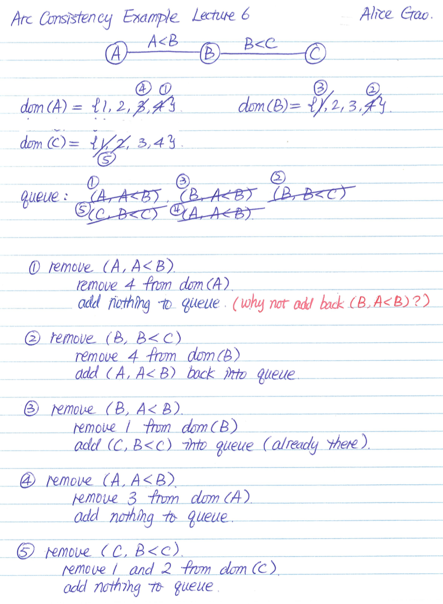

- *CQ: Number of Items in the Queue (p.35) - D*
  - see example (queue)

- *CQ: Adding an Arc into the Queue (p.36) - B*
  - 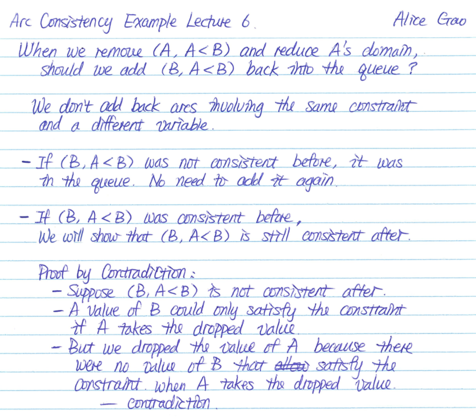

## 6. Constraint Satisfaction Problems: Backtracking Search

#### Searching for a solution to a CSP

- 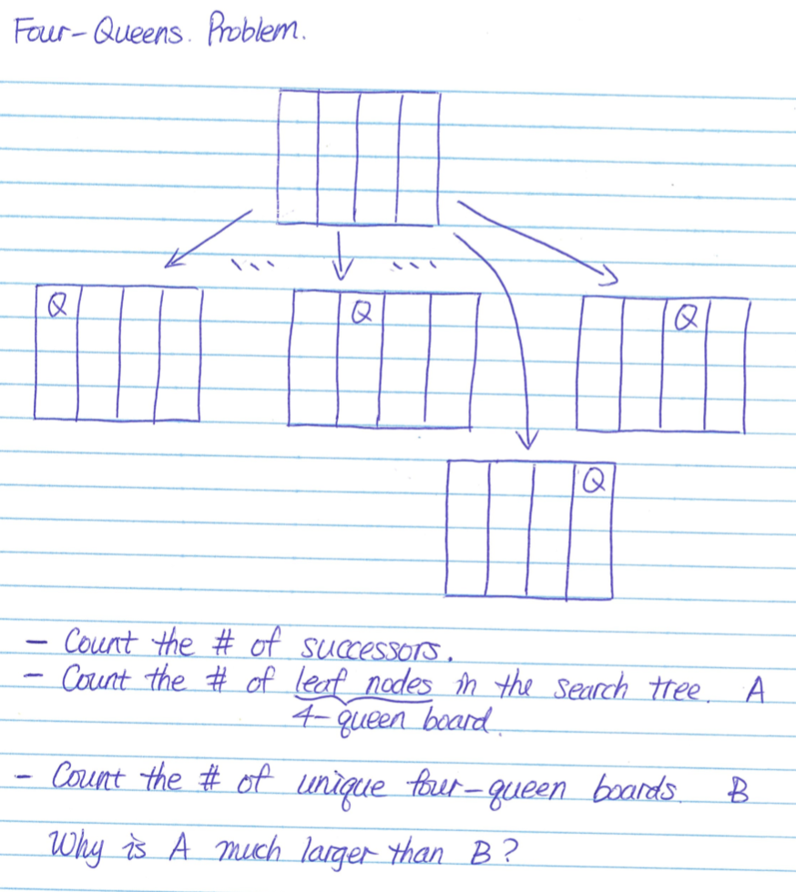

- How many successor states are there for any state?

  - <u>???</u>

- Each leaf node corresponds to a four-queen board. How many 

  leaf nodes are there in the search tree?

  - $16 \times 12 \times 8 \times 4 = 6144$ (many repeated states) 

- How many unique four-queen boards are there?

  - $4^4 = 256$

- *CQ: Naive Depth-First Search on a CSP (p.5) - A (skipped)*

### The Backtracking Search Algorithm

- <u>??? - need to review this algorithm</u>

- *CQ: Conditions for trying another value (p.8) (skipped)*

#### Which variable and value should we choose next?

- **minimum-remaining-values** heuristic - prune search tree earlier
- **degree** heuristic - most constrained variable
- **least-constraining-value** heuristic - we want to find the solution

- *CQ: Applying the least-constraining-value heuristic (p.11) - B*
  - 2: rule out 3 possibilities; 3: rule out 2 possibilities (draw)
  - 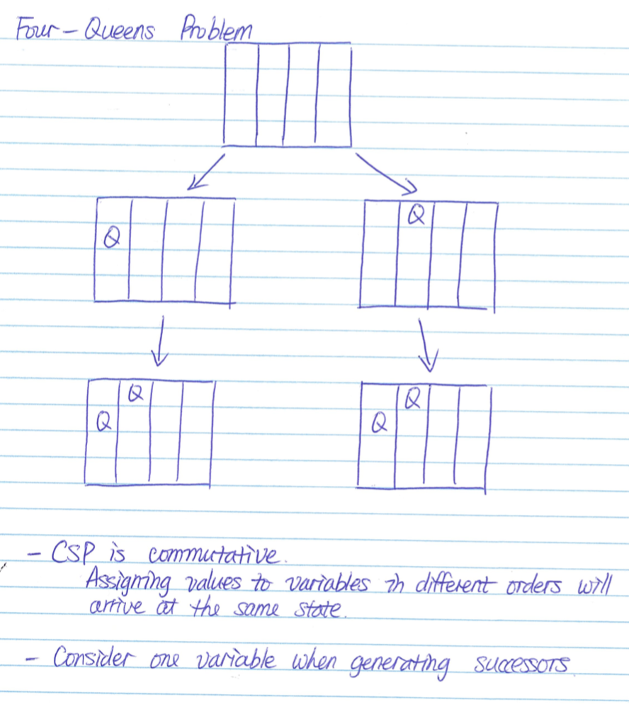

#### Interleaving search and inferences

- <u>??? did not follow</u>

- 

> ==Lecture 7 (2018-10-1)==

#### Quiz 2

- Q4 & Q5 (on posted sheet)
- 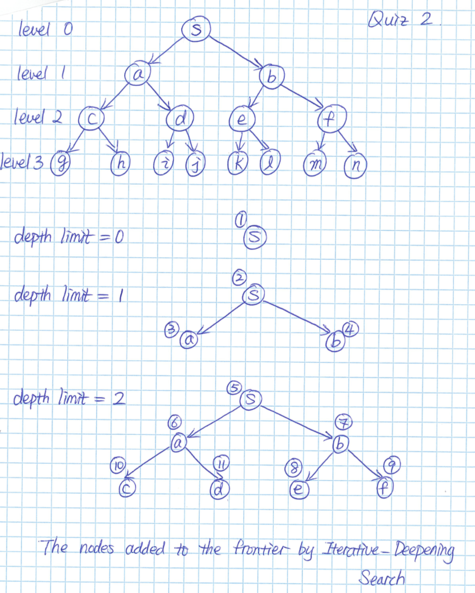

#### Backtrack Alg

- 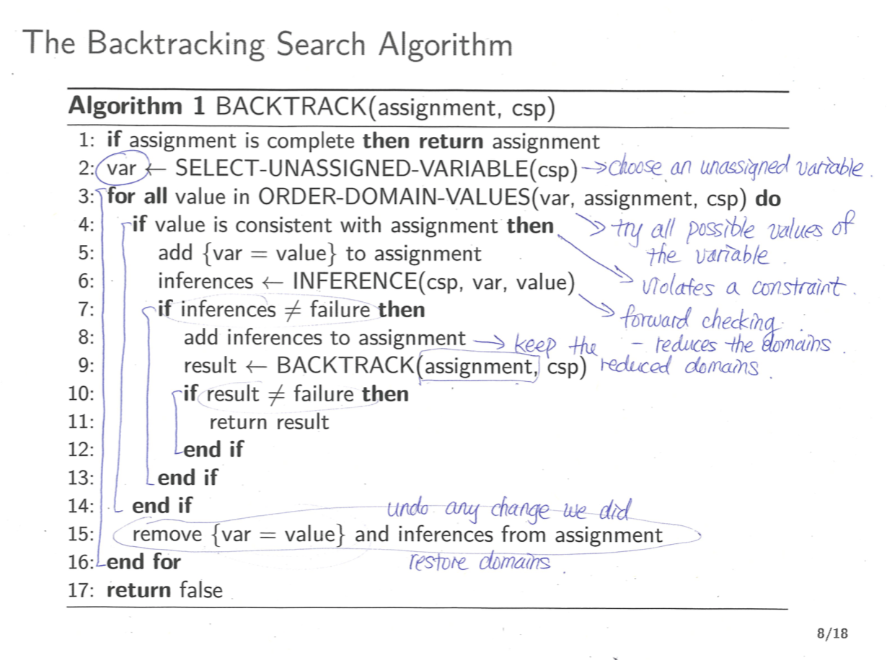

## 7. Constraint Satisfaction Problems: Local Search

### Introduction to Local Search

- Local Search (p.7)

- neighbour relation -> successor function

#### 4-Queens Problem

- 

- 
- 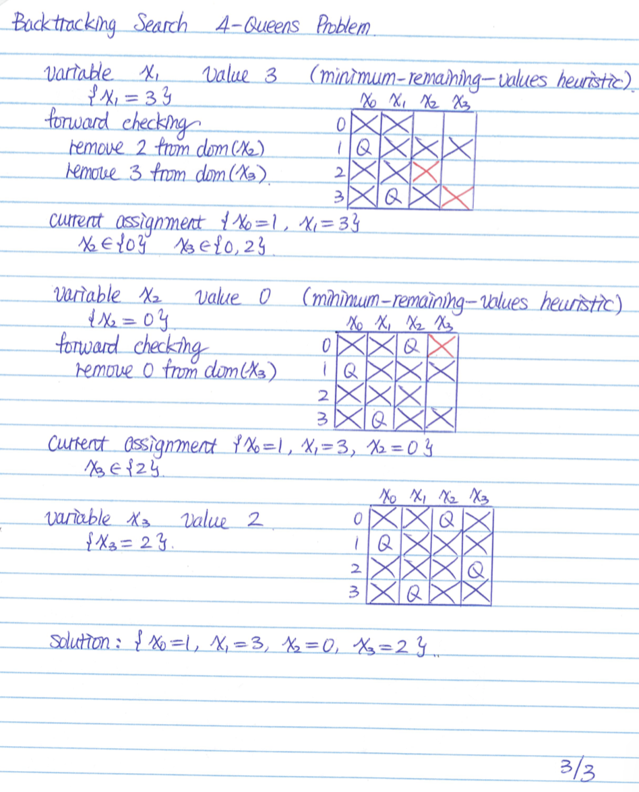

-  

#### Choosing the Neighbour Relation

- bigger neighbourhoods:
  - good steps, but each step is more expensive
- smaller neighbourhoods:
  - each step is OK, but we can take a lot of steps fast

#### Traveling Salesperson Problem

- 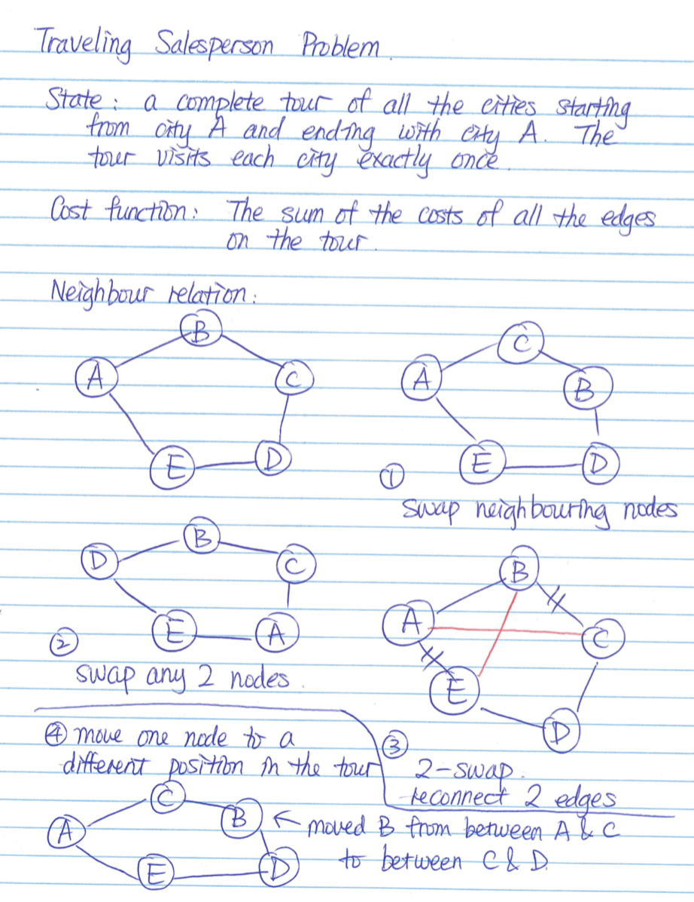

### Local Search Algorithms

#### Hill climbing

- thick fog - cannot look far

- amnesia - no memory
- *CQ: Will hill climbing find the global optimum? (p.15) - B*
- 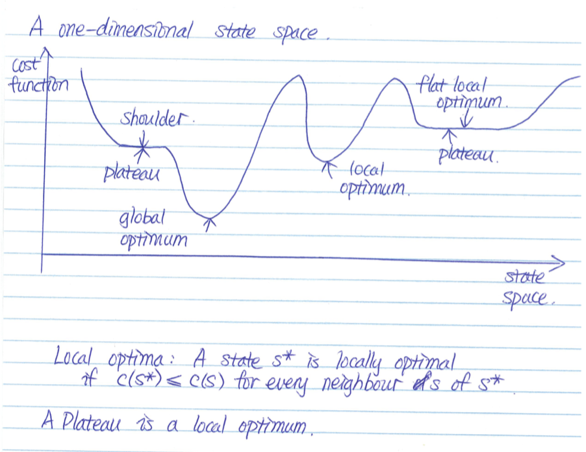
- *CQ: Is this state a local optimum? (p.17) - B*
- *CQ: Is this state a local optimum? (p.18) - A*

